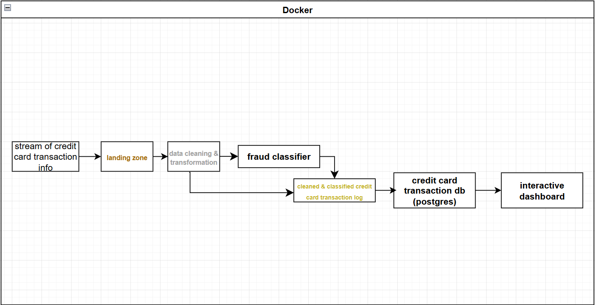

<h1>Credit card fraud simulator</h1>

# table of contents
[Introduction](#introduction)
[How to run](#instructions)
[Pipeline](#Pipeline)

[Dataset](#dataset)

[Fraud Detection Classifier](#classifier)

## Introduction

This project simulates credit card transactions, detects fraudulent cases by
using a trained ml-model and displays
various related metrics to an interactive dashboard; mainly, the geographical location of the
transaction, transaction category, amount, and fraud status. The whole program is also compatible with docker. The dashboard is created with dash and plotly, showing metrics for predicted fraud, actual fraud, false positives, and false negatives.
 

## How to run the simulation

 To run this program locally, uncomment the appropriate line in "run.py" and execute the code.
Likewise for docker, uncomment the appropriate line and create a docker-image. REMINDER: the dashboard for docker runs on localhost:8050.

## Pipeline

This project uses the medallion architecture for its pipeline. Credit card transaction info is simulated by reading
a CSV file one line at a time. Afterwards, the transaction is stored into a log, whilst a copy is transformed and fed into the 
fraud classifier. Then the result of the fraud classifier is combined with the stored transaction log and pushed into
a database (simulated by another csv file). Finally, a dash dashboard application will read and display data from the database. 

----------------------------------

## Dataset
the credit card transaction **[dataset](https://www.kaggle.com/datasets/priyamchoksi/credit-card-transactions-dataset)** is
taken from kaggle. It consists of over 20 variables, including credit card holder information (name, credit card number,
job/profession,...etc). The data set contains 1.3 million transactions, where 7506 of them are fraudulent. After removing
all rows with at least one missing value in one of its columns, the total size shrank to 1.1 million transactions.
For practical reasons, the simulated data stream will consist of a total of 5000 credit card transactions, having a 
80/20 legitimate to fraud ratio.

## Classifier

 xgboost was used to create the fraud detection classifier. The reason
for this is that it is fairly simple to implement,
while providing lower variance (therefore being more accurate) compared
to other classifier models like logistic regression or random forest. 

The training set consisted of 1.1 million credit card transactions, whereas the testing set had 220 thousand transactions,
yielding an 80/20 train/test split 

A learning rate of 0.1 yielded the best results in terms of model 
adequacy. Legitimate transactions were coded as "0", while fraudulent transactions were coded as "0". 

**XGBoost classification report**

| Class | Precision | Recall | F1-Score | Support |
|-------|-----------|--------|----------|---------|
| 0.0   | 1.00      | 1.00   | 1.00     | 218,838 |
| 1.0   | 0.88      | 0.64   | 0.74     | 1,303   |

**confusion matrix**

|               | Predicted 0 | Predicted 1 |
|---------------|-------------|-------------|
| Actual 0      | 218,728     | 110         |
| Actual 1      | 469         | 834         |

Unsurprisingly, the precision and recall for legitimate transactions are 1, which makes sense since the event of
fraud is so rare. Since the fraud has a recall rate of 0.64, the model missed 34% of fraudulent transactions, indicating that xgboost might not be the best-suited algorithm for this task. 
