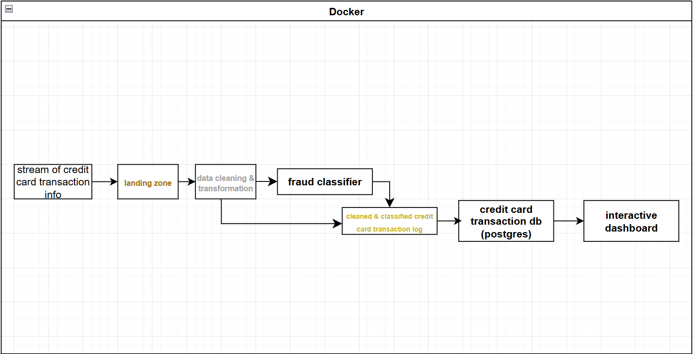
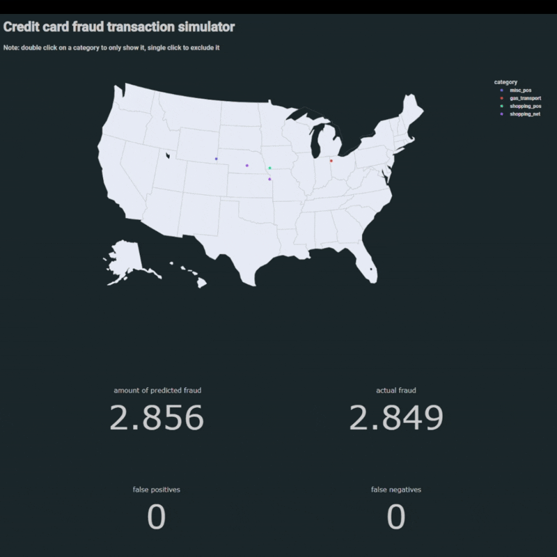

<h1>Credit card fraud simulator</h1>

# table of contents
[Introduction](#introduction)

[Pipeline](#Pipeline)

[Dataset](#dataset)

[Fraud Detection Classifier](#classifier)

[Dashboard](#dashboard

## Introduction

This project is simulates credit card transactions, detects fraudulent cases by
using a trained ml-model and displays
various related metrics to an interactive dashboard; mainly, the geographical location of the
transaction, transaction category, amount, and fraud status. Furthermore, the dashboard shows metrics for predicted fraud,
actual fraud, false positives, and false negatives. Lastly all of this is made into a Dockerizable container
 

## Pipeline

This project uses the medallion architecture for its pipeline. Credit card transaction info is simulated by reading
one line at a time from a csv file. Afterwards, the transaction is stored in a log, whilst a copy is transformed and fed into the 
fraud classifier. Then the result of the fraud classifier is combined with the stored transaction log and pushed into
a PostgreSQL database. Finally, a dash dashboard application will read and display data from the database. However, to keep the
size of this project manageable, the postgres database is replaced with a csv file.

----------------------------------

## Dataset
the credit card transaction **[dataset](https://www.kaggle.com/datasets/priyamchoksi/credit-card-transactions-dataset)** is
taken from kaggle. It consists of over 20 variables, including credit card holder information (name, credit card number,
job/profession, etc). The dataset contains 1.3 million transactions occurring in the US, of which 7506 are fraudulent. After removing
all rows with at least one missing value in one of its columns, the total size shrank to 1.1 million transactions.
For practical reasons, the simulated data stream will consist of a total of 5000 credit card transactions, having a 
80/20 legitimate to fraud ratio.

## Classifier

 xgboost was used to create the fraud detection classifier. The reason
for this is due to the fact that it is fairly simple to implement,
while providing lower variance (therefore being more accurate) compared
to other classifier models like multinomial logistic regression or random forest. The drawback, however, is that
we are unable to analyze the dependent variables, unlike in logistic regression. 

The training set consisted of 1.1 million credit card transactions, whereas the testing set had 220 thousand transactions.
yielding an 80/20 train/test split.

A learning rate of 0.1 yielded the best results in terms of model 
adequacy. Fraudulent transactions were coded as "0", while legitimate transactions were coded as "1". 

**XGBoost classification report**

| Class | Precision | Recall | F1-Score | Support |
|-------|-----------|--------|----------|---------|
| 0.0   | 1.00      | 1.00   | 1.00     | 218,838 |
| 1.0   | 0.88      | 0.64   | 0.74     | 1,303   |

**confusion matrix**

|               | Predicted 0 | Predicted 1 |
|---------------|-------------|-------------|
| Actual 0      | 218,728     | 110         |
| Actual 1      | 469         | 834         |

Unsurprisingly, the precision and recall for legitimate transactions are 1, which makes sense since the event of
fraud is so rare.  

## dashboard
The dashboard contains a geographical map of the US. The points on the map represent the location where the transaction
took place. When hovering on the point, the following label information pops up:

**Label information**

| variable name |   description    |  data type  |
|---------------|------------------|-------------|
| category      | purchase category| categorical |
| lat           | customer latitude| numerical   |
| lon           |customer longitude| numerical   |
| city          | city of purchase | categorical |
| city_pop      |population of city| numerical   |
| state         | state of city    | categorical |
| amt           |transaction amount| numerical   |
| is_fraud      |fraud status      | categorical |
| job           |customer job title| categorical |

to the right of the map are all the transaction categories, which
are shown below:

**transaction categories**
| variable name |        description            |
|---------------|-------------------------------|
| misc_pos      | miscellaneous point of sale   |
| gas_transport | gas pump                      |
| shopping_pos  | shop point of sale            |
| food_dining   | restaurant purchase           |
| grocery_pos   | grocery store point of sale   |
| misc_net      |miscellaneous online purchase  |
| entertainment |entertainment related purchase |
| kids_pets     |kid or pet related purchase    |
| grocery_net   |online grocery purchase        |
| personal_care |personal care related purchase |
| home          | home related purchase         |
| travel        |travel related purchase        |
| health_fitness|health and fitness purchase    |

The categories can be either toggled to show a specific one, or to exclude
a category.

Lastly, the four counters display the amount of predicted fraud, actual fraud,
false positives (predicted as fraud when actually legitimate) and
false negatives(predicted as legitimate transactions when actually fraud).
**dashboard**

